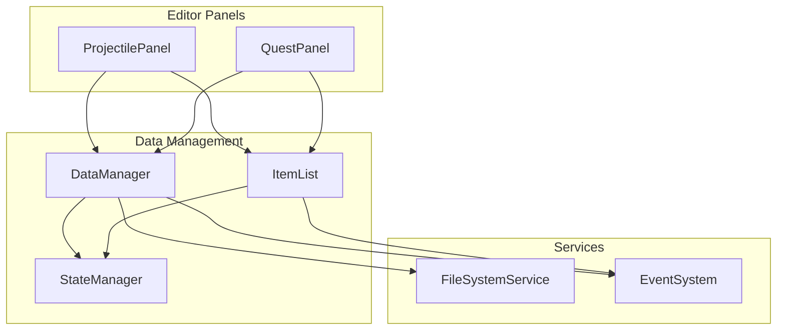
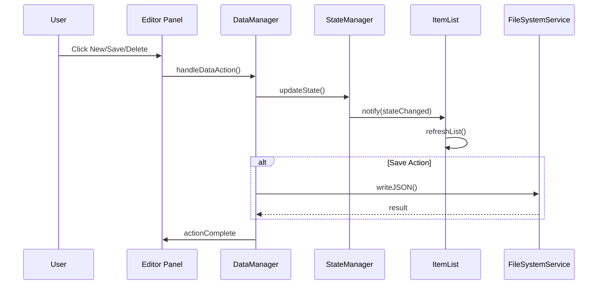

# Design Document: Editor Data Management

## Overview

本设计文档描述了弹道编辑器和任务编辑器的数据管理功能增强，包括统一的CRUD操作、数据列表索引修复、名称同步功能以及任务奖励模块的开关/变量显示修复。

## Architecture

### Component Diagram



### Data Flow



## Components and Interfaces

### 1. DataManager Interface

```typescript
interface DataManagerActions {
  /** 创建新数据项 */
  createItem(fileType: 'projectile' | 'quest'): void;
  
  /** 保存当前数据到文件 */
  saveData(fileType: 'projectile' | 'quest'): Promise<boolean>;
  
  /** 删除当前选中的数据项（设为null） */
  deleteItem(fileType: 'projectile' | 'quest'): Promise<boolean>;
}
```

### 2. ProjectilePanel Enhancements

```typescript
interface ProjectileDataEntry {
  name: string;  // 新增：弹道名称
  startAnimationId: number;
  launchAnimation: LaunchAnimation;
  endAnimationId: number;
  // ... existing fields
}

interface ProjectilePanelEnhancements {
  /** 名称输入框引用 */
  nameInput: HTMLInputElement;
  
  /** 处理名称变更 */
  handleNameChange(name: string): void;
  
  /** 新建弹道数据 */
  newProjectile(): void;
  
  /** 保存弹道数据 */
  saveProjectile(): Promise<void>;
  
  /** 删除弹道数据 */
  deleteProjectile(): Promise<void>;
}
```

### 3. QuestPanel Enhancements

```typescript
interface QuestPanelEnhancements {
  /** 处理标题变更并同步列表 */
  handleTitleChange(title: string): void;
  
  /** 修复奖励模块的开关/变量选择框 */
  buildRewardSwitchSelect(switchId: number): HTMLSelectElement;
  buildRewardVariableSelect(variableId: number): HTMLSelectElement;
}
```

### 4. ItemList Index Fix

```typescript
interface ItemListIndexFix {
  /** 
   * 渲染列表项时使用正确的索引
   * 对于quest类型，索引应从1开始（数组索引1显示为#1）
   */
  getDisplayIndex(arrayIndex: number, fileType: string): number;
}
```

## Data Models

### ProjectileTemplate (Enhanced)

```typescript
interface ProjectileTemplate {
  name: string;  // 新增字段
  startAnimationId: number;
  launchAnimation: {
    animationId: number;
    segments: TrajectorySegment[];
  };
  endAnimationId: number;
  // ... existing fields
}
```

### QuestReward (Existing - Reference)

```typescript
interface QuestReward {
  type: number;  // 6=开关, 7=变量
  switchId?: number;
  variableId?: number;
  targetValue?: number | boolean;
  op?: string;
  description?: string;
}
```

### SystemData (Reference)

```typescript
interface SystemData {
  switches: Array<string | null>;  // 索引0为null，从1开始
  variables: Array<string | null>; // 索引0为null，从1开始
}
```

## Correctness Properties

*A property is a characteristic or behavior that should hold true across all valid executions of a system-essentially, a formal statement about what the system should do. Properties serve as the bridge between human-readable specifications and machine-verifiable correctness guarantees.*

### Property 1: New Item Increases Data Length

*For any* valid data array and editor state, when the user creates a new item, the data array length SHALL increase by exactly 1 and the new entry SHALL have valid default values.

**Validates: Requirements 1.3**

### Property 2: Delete Sets Entry to Null

*For any* valid data array with a selected item at index N, when the user deletes the item, the entry at index N SHALL become null and the array length SHALL remain unchanged.

**Validates: Requirements 1.5, 1.6**

### Property 3: Quest Index Display Consistency

*For any* quest data array, when rendered in the data list, the displayed index for an item at array position N SHALL equal N (not N+1 or any other value).

**Validates: Requirements 2.1, 2.2, 2.3**

### Property 4: Name Change Synchronization

*For any* name/title change in the editor input field, the corresponding item in the data list SHALL immediately reflect the new name without requiring a save operation.

**Validates: Requirements 3.2, 4.1**

### Property 5: Data Save Round-Trip

*For any* valid data entry with a name/title, saving then loading the data SHALL produce an equivalent entry with the same name/title preserved.

**Validates: Requirements 1.4, 3.3, 4.2**

### Property 6: Reward Select Option Formatting

*For any* loaded system data with switches and variables, the reward section's switch and variable select options SHALL display in the format "ID : Name" where Name comes from the system data.

**Validates: Requirements 5.1, 5.2**

### Property 7: Reward Selection Persistence

*For any* switch or variable selection in the reward section, saving the quest data SHALL correctly persist the selected ID, and loading SHALL restore the same selection.

**Validates: Requirements 5.5**

## Error Handling

### File System Errors

- 保存失败时显示错误提示，不修改内存中的数据状态
- 加载失败时保持当前状态，显示错误信息

### Invalid Data Handling

- 删除操作前验证当前选中索引有效
- 新建操作确保默认值符合数据模型要求
- 系统数据未加载时显示占位符文本

### Edge Cases

- 空数据列表时禁用删除按钮
- 未选择项目时禁用保存和删除按钮
- 系统数据未加载时开关/变量选择框显示"未加载"提示

## Testing Strategy

### Unit Tests

- 测试 `getDisplayIndex` 函数对不同文件类型的索引计算
- 测试 `buildRewardSwitchSelect` 和 `buildRewardVariableSelect` 的选项生成
- 测试默认数据创建函数的返回值结构

### Property-Based Tests

使用 `fast-check` 库进行属性测试：

1. **Property 1 Test**: 生成随机数据数组，执行新建操作，验证长度增加
2. **Property 2 Test**: 生成随机数据数组和有效索引，执行删除，验证该索引为null
3. **Property 3 Test**: 生成随机quest数据，渲染列表，验证所有索引正确
4. **Property 5 Test**: 生成随机数据，保存后加载，验证数据等价
5. **Property 6 Test**: 生成随机系统数据，验证选项格式正确
6. **Property 7 Test**: 生成随机奖励配置，保存加载后验证ID一致

### Integration Tests

- 测试完整的新建-编辑-保存-加载流程
- 测试名称变更后列表同步更新
- 测试删除后列表正确显示占位符

### Test Configuration

- 每个属性测试运行最少100次迭代
- 测试标签格式: `**Feature: editor-data-management, Property N: {property_text}**`
