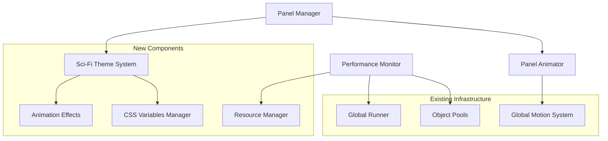

# Design Document: Editor Modernization

## Overview

This design addresses three critical issues in the RPG Data Editor: panel switching bugs, UI modernization with futuristic sci-fi styling, and comprehensive performance optimization. The solution leverages the existing global animation system and object pooling infrastructure while introducing a modern sci-fi theme system and enhanced panel management.

## Architecture

### Core Components



The design builds upon the existing global animation loop (`globalLoop.ts`) and object pooling system while adding new components for theme management and performance monitoring.

## Components and Interfaces

### Enhanced Panel Manager

The current `PanelManager` will be enhanced to fix the switching bug and integrate with the new theme system:

```typescript
interface EnhancedPanelManager {
  // Existing methods enhanced
  showPanel(mode: EditorMode): Promise<void>;
  hideAllPanels(): void;
  
  // New methods for bug fixes
  forceCleanupPanel(mode: EditorMode): void;
  validatePanelState(): boolean;
  
  // Theme integration
  applyThemeToPanel(panel: HTMLElement, mode: EditorMode): void;
}
```

**Key Bug Fix**: The switching issue occurs because the `PanelAnimator` doesn't properly sync with the initial panel state. The fix involves:
1. Ensuring `forceSetCurrentPanel()` is called during initialization
2. Adding `ensureOtherPanelsHidden()` safety checks
3. Implementing proper cleanup in panel transitions

### Sci-Fi Theme System

A new comprehensive theme system that provides futuristic styling:

```typescript
interface SciFiThemeSystem {
  // Core theme management
  initializeTheme(): void;
  applyThemeToElement(element: HTMLElement, variant: ThemeVariant): void;
  
  // Dynamic effects
  addGlowEffect(element: HTMLElement, color: string): void;
  addScanlineEffect(element: HTMLElement): void;
  addHologramEffect(element: HTMLElement): void;
  
  // Animation integration
  createThemeTransition(element: HTMLElement, duration: number): Motion;
}

type ThemeVariant = 'primary' | 'secondary' | 'accent' | 'warning' | 'success' | 'error';
```

### Performance Monitor

A new system to track and optimize performance:

```typescript
interface PerformanceMonitor {
  // Resource management
  trackMemoryUsage(): MemoryStats;
  optimizeGarbageCollection(): void;
  
  // Object reuse
  getReusableRegex(pattern: string): RegExp;
  getReusableCallback(key: string, fn: Function): Function;
  getReusableArray<T>(key: string): T[];
  
  // Performance metrics
  measureStartupTime(): number;
  measurePanelSwitchTime(mode: EditorMode): number;
  ensureFrameRate(targetFPS: number): boolean;
}
```

## Data Models

### Theme Configuration

```typescript
interface ThemeConfig {
  colors: {
    primary: string;
    secondary: string;
    accent: string;
    background: string;
    surface: string;
    text: string;
    textSecondary: string;
    border: string;
    glow: string;
  };
  
  effects: {
    glowIntensity: number;
    scanlineOpacity: number;
    hologramFlicker: number;
    transitionDuration: number;
  };
  
  typography: {
    fontFamily: string;
    fontSize: {
      small: string;
      medium: string;
      large: string;
    };
  };
}
```

### Performance Metrics

```typescript
interface PerformanceMetrics {
  startupTime: number;
  panelSwitchTimes: Record<EditorMode, number>;
  memoryUsage: {
    used: number;
    total: number;
    percentage: number;
  };
  frameRate: {
    current: number;
    average: number;
    drops: number;
  };
  objectPools: {
    motions: { active: number; pooled: number };
    commands: { active: number; pooled: number };
    domElements: { active: number; pooled: number };
  };
}
```

## Correctness Properties

*A property is a characteristic or behavior that should hold true across all valid executions of a system-essentially, a formal statement about what the system should do. Properties serve as the bridge between human-readable specifications and machine-verifiable correctness guarantees.*

### Property Reflection

After analyzing all acceptance criteria, several properties can be consolidated to eliminate redundancy:

- Properties 1.1 and 1.2 can be combined into a comprehensive panel switching property
- Properties 2.1-2.7 can be grouped into theme consistency properties
- Properties 3.1-3.4 and 3.8 can be combined into resource reuse properties
- Properties 4.1-4.5 can be consolidated into resource management properties

### Core Properties

**Property 1: Panel switching consistency**
*For any* sequence of panel switches between editor modes, only the target panel should be visible and properly initialized while all other panels are hidden and cleaned up
**Validates: Requirements 1.1, 1.2, 1.3, 1.4, 1.5**

**Property 2: Theme visual consistency**
*For any* UI element across all editor panels, the sci-fi theme properties (colors, fonts, effects) should be applied consistently according to the element's variant type
**Validates: Requirements 2.1, 2.2, 2.3, 2.4, 2.5, 2.6**

**Property 3: Animation system integration**
*For any* theme animation or panel transition, the global Animation_System should be used instead of setTimeout or other timing mechanisms
**Validates: Requirements 2.7, 4.4**

**Property 4: Resource reuse optimization**
*For any* frequently used resource type (regex patterns, callback functions, arrays, objects), the system should reuse existing instances instead of creating new ones
**Validates: Requirements 3.1, 3.2, 3.3, 3.4, 3.8**

**Property 5: Object pooling implementation**
*For any* object type that is frequently created and destroyed (panels, DOM elements, animations), the system should use object pooling to minimize allocation overhead
**Validates: Requirements 4.1, 4.2**

**Property 6: Resource cleanup consistency**
*For any* operation that creates resources (event listeners, animations, DOM elements), proper cleanup should occur when the operation completes or fails
**Validates: Requirements 4.3, 4.5**

**Property 7: Responsive layout adaptation**
*For any* screen size or container dimension, the sci-fi themed layouts should adapt appropriately while maintaining visual consistency and usability
**Validates: Requirements 5.1, 5.2, 5.3, 5.4, 5.5**

<function_calls>
<invoke name="prework">
<parameter name="featureName">editor-modernization

## Error Handling

### Panel Switching Errors

- **Race Condition Protection**: Use animation promises and state locks to prevent concurrent panel switches
- **Fallback Mechanisms**: If panel switching fails, revert to the last known good state
- **Resource Cleanup**: Ensure cleanup occurs even if panel switching is interrupted

### Theme Application Errors

- **Graceful Degradation**: If theme resources fail to load, fall back to basic styling
- **CSS Validation**: Validate theme properties before applying to prevent invalid styles
- **Animation Fallbacks**: If global animation system is unavailable, use CSS transitions

### Performance Monitoring Errors

- **Memory Threshold Handling**: When memory usage exceeds limits, trigger aggressive cleanup
- **Frame Rate Recovery**: If frame rate drops below 30fps, disable non-essential animations
- **Startup Timeout**: If startup exceeds 5 seconds, show loading progress and continue

## Testing Strategy

### Dual Testing Approach

This feature requires both unit tests and property-based tests for comprehensive coverage:

**Unit Tests** focus on:
- Specific panel switching scenarios (Quest → Projectile bug reproduction)
- Theme application to individual components
- Performance metric collection accuracy
- Error condition handling

**Property-Based Tests** focus on:
- Universal properties across all panel combinations
- Theme consistency across all UI elements
- Resource reuse patterns across all operations
- Performance characteristics under various loads

### Property-Based Testing Configuration

Using **fast-check** library for TypeScript property-based testing:
- Minimum **100 iterations** per property test
- Each test tagged with: **Feature: editor-modernization, Property {number}: {property_text}**
- Custom generators for:
  - Panel switching sequences
  - UI element hierarchies
  - Resource usage patterns
  - Performance scenarios

### Performance Testing

- **Startup Time**: Measure from application launch to first panel display
- **Panel Switch Time**: Measure transition duration between any two panels
- **Memory Usage**: Track object creation/destruction patterns
- **Frame Rate**: Monitor animation performance during heavy operations
- **Resource Reuse**: Verify object pools are utilized effectively

### Integration Testing

- **End-to-End Panel Workflows**: Test complete user journeys across multiple panels
- **Theme Consistency**: Verify visual consistency across the entire application
- **Performance Under Load**: Test with large datasets and rapid user interactions
- **Cross-Platform Compatibility**: Ensure consistent behavior across different operating systems